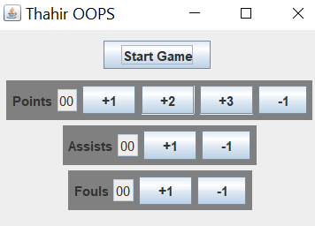
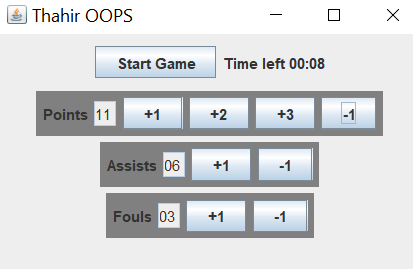
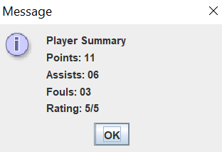

## Abstract

This report is for the mini-project for the Year 2 Object-Oriented Programming course. This GUI program acts as a simple Basketball Stats Tracker for a player. The report also contains the documentation for the program.

## Acknowledgements

I would like to thank Dr. Sujala D. Shetty and Dr. Pranav Mothabhau Pawar for providing me with the opportunity to perform this project, and for their guidance and supervision throughout the project. Furthermore, the concepts taught by them greatly helped with the execution of this research project. I would also like to thank my friends who helped me with this report. Lastly, I would like to thank my parents and sibling who have always supported me.

[toc]


## Introduction

### Authorization

This project has been authorized by Dr. Sujala D. Shetty, Associate Professor in the Department of Computer Science, at BITS Pilani Dubai Campus, on 11 November 2021.

### Historical Background

I am an athlete and I love using computer science in anything sports-related. So it is only appropriate that this project is sports-related as well.

The coach of a team usually instructs the players on the bench keep count of the stats of the active players, during a game. This ensures that everyone on the team knows what is happening, in order to avoid any tactical errors. Morever, this task boosts the morale of the bench players as well, as it gives them a sense of involvement. However, from my experience, this has always been a very tedious task, involving a lot of paper and pens, and in general, very messy and chaotic.

### Objective

To solve the aforementioned issue by creating a simple GUI program, using as many concepts from Object-Oriented Programming as possible.

### Scope and Limitations

- This project is only meant to be a mini-project, and hence is **not** ready-to-use without further improvement
- Concepts such as multi-threading were not implemented, as they were not applicable here
- Only one player per frame is possible right now

### Methodology

1. Class Notes
2. Forums and documentations
3. Images and Videos

### Report Preview

Including the ‘Introduction’, the report is divided into four sections. The ‘Program’ section shows and explains the program. The ‘Flowchart’ shows a simplified visualization for the working of the program, in a step-by-step manner. The ‘Conclusion’ sums up concepts used in this project.

## Program

What does it do?

The program has 1 player and keeps track of the

- time left in the game
- number of points scored
- number of assists
- number of fouls
  - if the number of fouls of the player reaches 5, the player is said to have ‘fouled out’, and hence, game for the player ends

At the end of the game, the following will appear

- summary of the players’ stats
- a rating based on the stats
  the current rating criteria are arbitrary and are meant to be changed for real use

### Programming Language

Java was the the programming language used for this project. Java is a high-level language, with advanced features, which makes it suitable for scaleable development. According to Java’s documentation page,

> Java is a set of several computer software products and specifications from Oracle / Sun Microsystems that together provide a system for developing application software and deploying it in a cross-platform computing environment.

### Tools

1. VS Code (Development Environment)
2. javac (Compiler)

## Code

This code is available on my [Github repository](https://github.com/AhmedThahir/oops).

### Importing Packages

One of the core features of Object Oriented Programming is modularity. This is achieved in java using classes and ‘packages’. Packages are a collection of classes, which help in enhancing features and simplify programs.

For this project, packages have been imported for the purposes of:

1. list
2. GUI
3. countdown timer

``` java
import java.util.ArrayList;

import javax.swing.*;
import java.awt.*;
import java.awt.event.ActionEvent;
import java.awt.event.ActionListener;

import java.util.Timer;
import java.util.TimerTask;
```

### Interface

This project did not necessarily need an interface, but I have added for the purpose of learning. Working for each of the below functions will be explained in below sections.

```java
interface Interface {
  public void reset();
  public void update();
  public void inc();
  public void dec();
}
```

### Container

This `Container`  class was also not necessary, but I have added for demonstration of nested classes.

An array list was used to simplify managing all the stats, using a `for` loop. Initially the `gameStatus` is set to false to ensure that the values do not get changed before the game starts. The `rating` variable is for the rating that will be displayed at the end of the game. The `timer` variable is for the countdown timer.

```java
class Container {
	ArrayList<Stat> stats = new ArrayList<Stat>();
  static boolean gameStatus = false;
  static int rating;
  Timer timer = new Timer();
  
  // below function
  
  // below classes
}
```

#### `rating()`

This function gives a rating for the player based on the stats during the game. The rating varies from 0-5. However, the criteria given here are arbitrary for demonstration purposed; they can be changed in future for more accurate ratings.

```java
public void rating() {
  rating = 0;
  if (stats.get(0).count < 1)
    rating++;
  else if (stats.get(0).count <= 3) // 2-3
    rating++;
  else if (stats.get(0).count <= 5) // 4-5
    rating += 2;
  else // 6 and above
    rating += 3;

  if (stats.get(1).count <= 1)
    ;
  else if (stats.get(1).count <= 3) // 2-3
    rating++;
  else // 4 and above
    rating += 2;

  if (stats.get(2).count == 4)
    rating--;
  else if (stats.get(2).count == 5)
    rating -= 2;

  if (rating < 0)
    rating = 0;
  if (rating > 5)
    rating = 5;
}
```

#### `Stat`

This class acts as the abstract class for all the 3 kinds of stats. They will be explained further.

`count` keeps track of numerical value of the stat, `countText` is used for displaying the value in the GUI, and `statName` is used for the label in the GUI.

```java
abstract class Stat implements Interface {
    int count;
    String countText;
    String statName;

    JPanel panel;
    JLabel lb;
    JTextField tf;
    JButton incBtn, decBtn,
    inc2Btn, inc3Btn;

		// below functions
}
```

##### `Stat()`

constructor for the `Stat` class. Initializes buttons common to all child classes, and then calls the [`reset()`](###reset()) function.

``` java
public Stat() {
  tf = new JTextField();
  tf.setEditable(false);

  panel = new JPanel();
  panel.setBackground(Color.gray);

  incBtn = new JButton("+1");
  decBtn = new JButton("-1");

  reset();
}
```

##### `reset()`

Resets stat count to 00 and calls the [`update()`](####update()) function.

``` java
public void reset() {
  count = 00;
  update();
}
```

##### `update()`

updates the stat values in the GUI

``` java
public void update() {
  countText = "";
  if (count < 10)
    countText += "0";
  countText += Integer.toString(count);

  tf.setText(countText);
}
```

##### `inc(), dec()`

These 2 functions increment and decrement the value by 1. They only work if the `gameStatus` is true to ensure that values do not get changed when the timer has run out, or when the player has fouled out.

``` java
public void inc() {
  if (gameStatus == true) {
    count++;
    update();
  }
}
public void dec() {
  if (gameStatus == true) {
    if (count > 0)
      count--;
    update();
  }
}
```

Each of the child classes of the `Stats` class have a constructor, to set the `statName`.

#### `Points`

As there are 2 and 3-pointers in basketball, the `Points` class has more buttons than the [`Assists`](###Assists) and [`Fouls`](###Fouls) classes

```java
class Points extends Stat {
    public Points() {
      inc2Btn = new JButton("+2");
      inc3Btn = new JButton("+3");
      statName = "Points";
      lb = new JLabel(statName);
    }
}
```

#### `Assists`

```java
class Assists extends Stat {
    public Assists() {
      statName = "Assists";
      lb = new JLabel(statName);
    }
}
```

#### `Fouls`

The criteria for fouls is different from [`Points`](###Points) and [`Assists`](###Assists), as the maximum number of fouls is only 4. A further foul will result in the player getting ejected. Hence, the [`FouledOutException`](###FouledOutException) is called.

```java
class Fouls extends Stat {
    public Fouls() {
      statName = "Fouls";
      lb = new JLabel(statName);
    }

    @Override
    public void inc() {
      if (gameStatus == true) {
        if (count < 5)
          count++;
        update();

        if (count == 5) {
          new End();
          throw new FouledOutException();
        }
     }
   }
}
```

#### `GUI`

This class takes care of the GUI of the program.

- it extends `JFrame` class to create a frame for the program
- it implements `ActionListener` interface to add interactivity to the program

``` java
class GUI extends JFrame implements ActionListener {
  Points p = new Points();
  Assists a = new Assists();
  Fouls f = new Fouls();

  JLabel countDownText = new JLabel();
  JPanel countDownPanel = new JPanel();
  JButton startBtn;
  
  // below functions
}
```

##### `GUI()`

This function is a constructor of the `GUI` class. It adds the following GUI elements:

1. Frame
2. Title
3. Labels
4. Textfields
5. Buttons

A `for` loop has been used to simplify addition of the elements. 

```java
public GUI() {
  setLayout(new FlowLayout());
  setTitle("Thahir OOPS");

  startBtn = new JButton("Start Game");
  startBtn.addActionListener(this);
  countDownPanel.add(startBtn);

  countDownPanel.add(countDownText);

  add(countDownPanel);

  stats.add(p);
  stats.add(a);
  stats.add(f);
  for (int i = 0; i < stats.size(); i++) {
    stats.get(i).decBtn.addActionListener(this);
    stats.get(i).incBtn.addActionListener(this);

    stats.get(i).panel.add(stats.get(i).lb);
    stats.get(i).panel.add(stats.get(i).tf);

    stats.get(i).panel.add(stats.get(i).incBtn);

    if (stats.get(i).statName.equals("Points")) {
      stats.get(i).inc2Btn.addActionListener(this);
      stats.get(i).inc3Btn.addActionListener(this);
      stats.get(i).panel.add(stats.get(i).inc2Btn);
      stats.get(i).panel.add(stats.get(i).inc3Btn);
    }

    stats.get(i).panel.add(stats.get(i).decBtn);

    add(stats.get(i).panel);
  }

  setDefaultCloseOperation(JFrame.EXIT_ON_CLOSE);
  setSize(450, 500);
  setVisible(true);
}
```

##### `countDown()`

This function is used for the evaluation and the display of the countdown timer. The `TimerTask()` class is defined using the concept of *anonymous class*.

The timer is supposed to start at 10m and 0s, representing a quarter in the game of basketball; for the purpose of demonstration, it has been set at just 10s.

`display()` converts the remaining value into a string and changes the value of the countdown textframe in the GUI. The if conditions are present to ensure that the display is always in 2 digit form, even if the remaining minutes or seconds is less than 10. This is purely for aesthetics.

`update()` is responsible for the evaluation of the remaining time. It calls the `End()` if `m` becomes negative , as the program obviously should end if there is the timer has completed.

`run()` calls `display() ` and `updates()` every second.

``` java
public void countDown() {
  gameStatus = true;

  timer.scheduleAtFixedRate(new TimerTask()
	{
    int m = 00, s = 10;
    String text;

    public void display() {
      text = "";

      if (m < 10)
        text += "0";
      text += Integer.toString(m);

      text += ":";

      if (s < 10)
        text += "0";
      text += Integer.toString(s);

      countDownText.setText("Time left \t" + text);
    }

    public void update() {
      s--;
      if (s < 0) {
        m--;
        s = 59;
      }
      if (m < 0) {
        new End();
      }
    }

    public void run() {
      display();
      update();
    }
  }, 0, 1000);
}
```

##### `actionPerformed()`

This function defines what is to happen when any of the buttons are pressed.

The `startBtn` resets all the values through corresponding `reset()` and calls `countDown()` to start the countdown, marking the start of the basketball game. It only works if `gameStatus` is false, to ensure that 2 instances of the timer do not occur.

The other buttons aid in incrementing and decrementing corresponding values.

``` java
@Override
public void actionPerformed(ActionEvent e) {
  if ((e.getSource() == startBtn) && gameStatus == false) {
    for (int i = 0; i < stats.size(); i++)
      stats.get(i).reset();
    countDown();
  }
  if (e.getSource() == p.incBtn)
    p.inc();
  if (e.getSource() == p.inc2Btn) {
    p.inc();
    p.inc();
  }
  if (e.getSource() == p.inc3Btn) {
    p.inc();
    p.inc();
    p.inc();
  }
  if (e.getSource() == p.decBtn)
    p.dec();

  if (e.getSource() == a.incBtn)
    a.inc();
  if (e.getSource() == a.decBtn)
    a.dec();
  if (e.getSource() == f.incBtn)
    f.inc();
  if (e.getSource() == f.decBtn)
    f.dec();
}
```

#### `FouledOutException`

When a player has commited 5 fouls, the game ends for that player, but goes on for the other. Hence, a custom exception is used for the message of this purpose.

```java
class FouledOutException extends IllegalArgumentException {
  FouledOutException() {
    super("Fouled out of the game with 5 fouls");
  }
}
```

#### `End`

Used for the summary and display a final message box, marking the end of the program.

```java
class End extends JFrame {
  End() {
    if (gameStatus == true) {
      gameStatus = false;
      timer.cancel();
      String text = "Player Summary\n";

      for (int i = 0; i < stats.size(); i++) {
        text += stats.get(i).statName;
        text += ": ";
        text += stats.get(i).countText;
        text += "\n";
      }

      rating();
      text += "Rating: " + Integer.toString(rating) + "/5";

      JOptionPane.showMessageDialog(this, text);
    }
  }
}
```

### Tester Class

This is the class containing the `main()`. In the `main()`, a nested class’ constructor is called using the parent class and `.` operator.

```java
class Project {
  public static void main(String args[]) {
    new Container().new GUI();
  }
}
```

## Outputs

### Start Screen



### Updating



### Summary



## UML Diagram

```mermaid
classDiagram

class Container {
	stats: ArrayList<Stats>
	gameStatus: boolean
	rating: int
	timer: Timer
	
	+rating(): void
}

class Interface {
	<<interface>>
	
	+reset() void
	+update() void
	+inc() void
	+dec() void
}

class Stat {
	<<abstract>>
	count: int
	countText: String
	statName: String
	
	panel: JPanel
	lb: JLabel
	tf: JTextField
	incBtn: JButton
	inc2Btn: JButton
	inc3Btn: JButton
	decBtn: JButton
	
	+Stat()
	+reset() void
	+update() void
	+inc() void
	+dec() void
}

class Points {
	+Points()
}

class Assists {
	+Assists()
}

class Fouls {
	+Fouls()
	+inc() void
}

class JFrame
class ActionListener {
	<<interface>>
}

class GUI {
	p: Points
	a: Assists
	f: Fouls
	
	countDownText: JLabel
	countDownPanel: JPanel
	startBtn: JButton
	
	+GUI()
	+countDown void
	+actionPerformed() void
}

class IllegalArgumentException
class FouledOutException {
	+FouledOutException()
}
class End {
	+End()
}

class Project {
	+main() void
}

Interface <|-- Stat :implements

Stat <|-- Points
Stat <|-- Assists
Stat <|-- Fouls

Points <.. GUI
Assists <.. GUI
Fouls <.. GUI

ActionListener <|-- GUI :implements
JFrame <|-- GUI
JFrame <|-- End

IllegalArgumentException <|-- FouledOutException
FouledOutException <.. Fouls

End <.. GUI
GUI <.. Project
```

## Flowchart

```mermaid
flowchart
s([Start]) -->
pkg[Import packages] -->
gui[Create GUI and add elements] -->
sBtn{Start button clicked?}

sBtn-->|No|sBtn
sBtn-->
|Yes|timer[Timer starts] -->
continue{Time left? Fouls<5?}

continue-->|No| p[/Print Summary/] --> stop([Stop])
continue-->
|Yes|inc/dec{Inc/Dec buttons clicked?}

inc/dec -->|No| continue
inc/dec -->|Yes| update[Update values] --> continue
```

## Conclusion

Concepts used

- [x] Basic
  - Conditional Statement (if-else)
  - Loops (for)
  - Operators (Logical, Arithmetic)
- [x] Classes
  - Contructors
  - Method Overloading
  - Inheritance
  - Abstract Class
  - Nested Class
  - Anonymous Class

- [x] Objects
- [x] Interfaces
- [x] Strings
- [x] Packages
- [x] Exception
- [x] Type Casting
- [x] `static`
  - Variables
  - Functions
- [x] `ArrayList`
- [x] GUI using `Swing`
  - Frames
  - Labels
  - Textfields
  - Buttons
- [x] Event Handling using `AWT`
- [x] UML Class Diagram


## Bibliography

1. Oracle Help Center. “Java Documentation.” Accessed December 11, 2021. https://docs.oracle.com/en/java/.
2. Lucidchart. UML Class Diagram Tutorial, 2017. https://www.youtube.com/watch?v=UI6lqHOVHic.
   Soham Govande. 
3. How to Code a TIMER in Java! | Java Tutorial, 2015. https://www.youtube.com/watch?v=36jbBSQd3eU.
4. “Unified Modeling Language (UML) Description, UML Diagram Examples, Tutorials and Reference for All Types of UML Diagrams - Use Case Diagrams, Class, Package, Component, Composite Structure Diagrams, Deployments, Activities, Interactions, Profiles, Etc.” Accessed December 11, 2021. https://www.uml-diagrams.org/.
5. Yadav, Rupam. “Make a Countdown Timer in Java.” Delft Stack, June 3, 2021. https://www.delftstack.com/howto/java/countdown-timer-java/.

